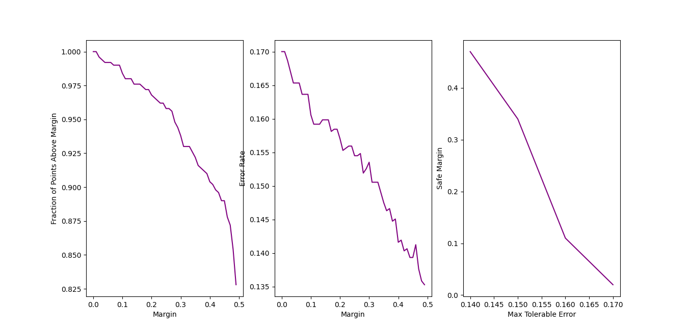

# sentiments_cared

## Introduction

The fourth week's programming assignment for the UCSanDiego online course covers the use of logistic regression in sentiment analysis.

## Datasets

The dataset contains comments with their sentiment class labels from three websites. It is downloaded from [here](https://colab.research.google.com/corgiredirector?site=https%3A%2F%2Farchive.ics.uci.edu%2Fml%2Fdatasets%2FSentiment%2BLabelled%2BSentences). Consult the README file in the data directory for more details.

### Processing methods

#### Loading the dataset

We use a shuffle of the dataset from a fixed permutation.

The preprocessing on the dataset includes:
- Removing digits
- Removing punctuations
- Lower-casing
- Removing stop words

 Next, we split the dataset into train and test sections including 2500 and 500 data entries respectively.

Finally, we remap the labels from "0 vs. 1" to "-1 vs. 1".

#### Creating the model

We use the scikit-learn package's linear model module to create a stochastic gradient descend classifier and fit it to data. This model is then used to predict the classes and probabilities of the test data.

## Dependencies

This project uses Python 3.10.12 to run and for a list of requirements consult the requirements.txt list.

## Run

To run the project, configure the `conf.yaml` with data about the preprocessing method and dataset features. Then run the entry point `main.py`.s

## Results

We achieved average train and test errors of 0.0026 and 0.17 when fitting the model to train data.

Then we calculated the number of points beyond various margins, the error rate for each margin and the safe margin for each expected error rate. The results are illustrated in the following figure.

